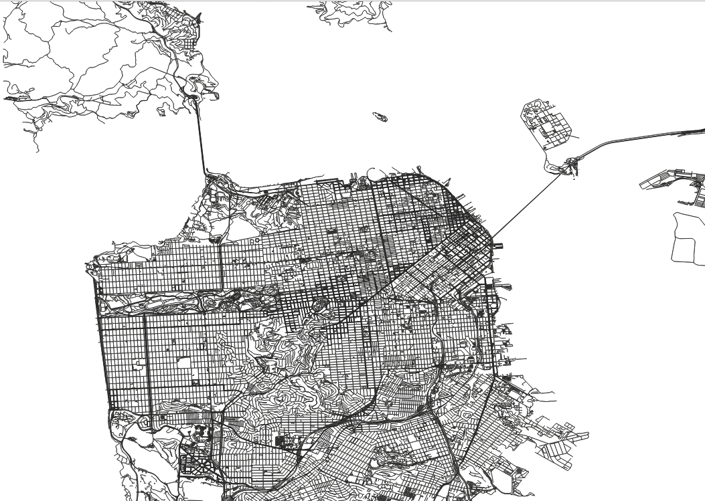

# OSM Road Graph Extractor

This project is a simple command-line tool that reads a .osm.pbf file containing OpenStreetMap data and generates a road graph in the form of two CSV files: one for the nodes and one for the edges. The road graph can be used for various purposes, such as routing or visualizing the road network.



## Running
```
cargo run --release -- --pbf-file ~/SanFrancisco.osm.pbf --output-dir data
```

## Output
The road graph is written to two CSV files: one for the nodes and one for the edges. The node CSV file has the following format:

```
node_id,latitude,longitude
1,47.12345,-122.12345
2,47.23456,-122.23456
```
Each row in the file represents a node in the road graph, and includes the following information:   

node_id: The unique identifier of the node.  
latitude: The latitude coordinate of the node.  
longitude: The longitude coordinate of the node.  

The edge CSV file has the following format:

```
from_node_id,to_node_id
1,2
2,3
```
Each row in the file represents an edge in the road graph.

## License
This project is released under the BSD license. See LICENSE for more information.
